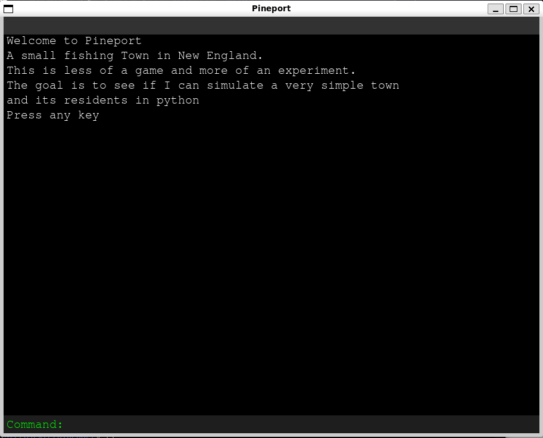
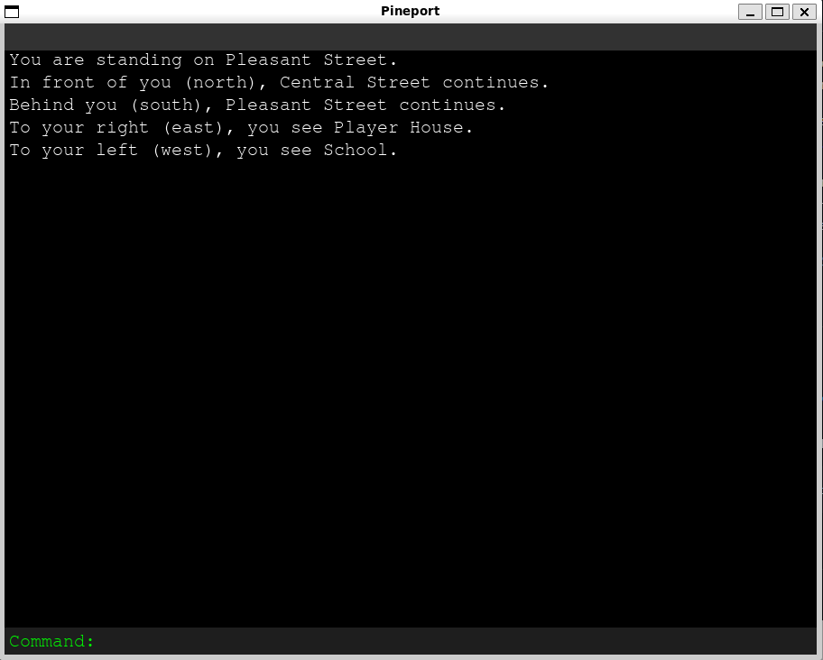
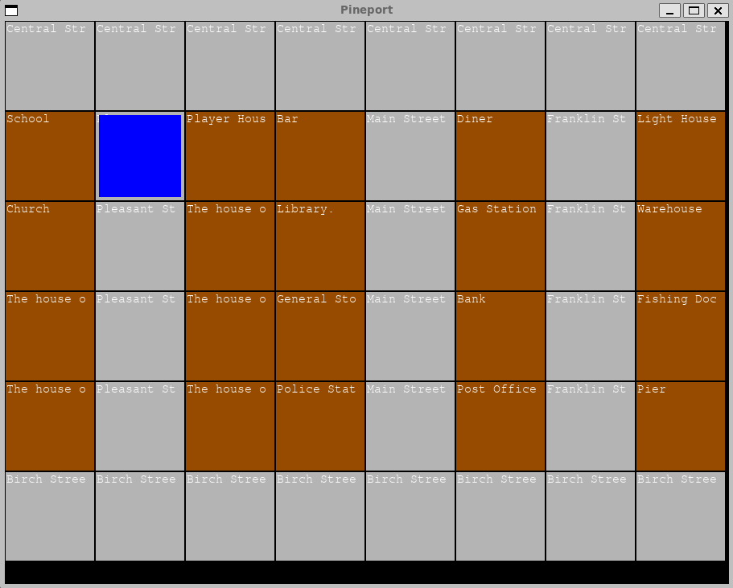

# Pineport - A Small Town Simulator

While walking around the city in **The Evil Within 2**, I wondered if I could create a town on a much smaller scale in Python — **a text-based town simulator**.

This is not a **traditional text adventure**. Instead, the goal is to simulate a tiny town where you can:

- Walk around the streets
- Enter houses
- Interact with NPCs

Eventually, I plan for:

- NPCs to have their own daily schedules
- Pathfinding for NPC movement
- Perhaps basic AI-driven interactions

Current Status:

- You can walk around the city
- You can enter certain houses
- NPCs and daily schedules are still in development

This project is work in progress, and the main goal is to explore town simulation mechanics and interactive systems in Python.

## Screenshots

